DriveDrive

<<<<<<< HEAD

=======
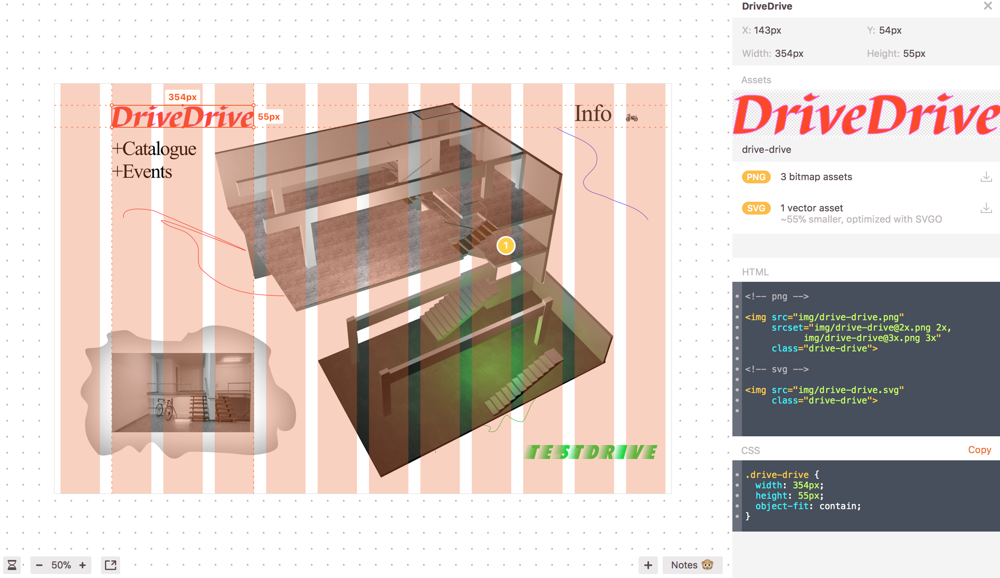
>>>>>>> 03bfecf16822cd992f357d04e0379c9b8bd1ff51

```css
.drive-drive {
	width: 354px;
	height: 55px;
	object-fit: contain;
}
```


Catalogue

<<<<<<< HEAD

=======
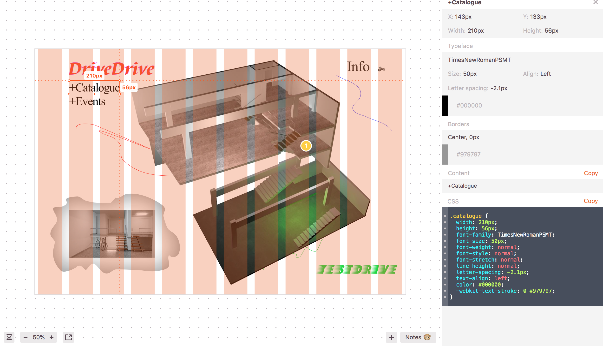
>>>>>>> 03bfecf16822cd992f357d04e0379c9b8bd1ff51

```css
.catalogue {
	width: 210px;
	height: 56px;
	font-family: TimesNewRomanPSMT;
	font-size: 50px;
	font-weight: normal;
	font-style: normal;
	font-stretch: normal;
	line-height: normal;
	letter-spacing: -2.1px;
	text-align: left;
	color: #000000;
	-webkit-text-stroke: 0 #979797;
}
```

Events

<<<<<<< HEAD

=======
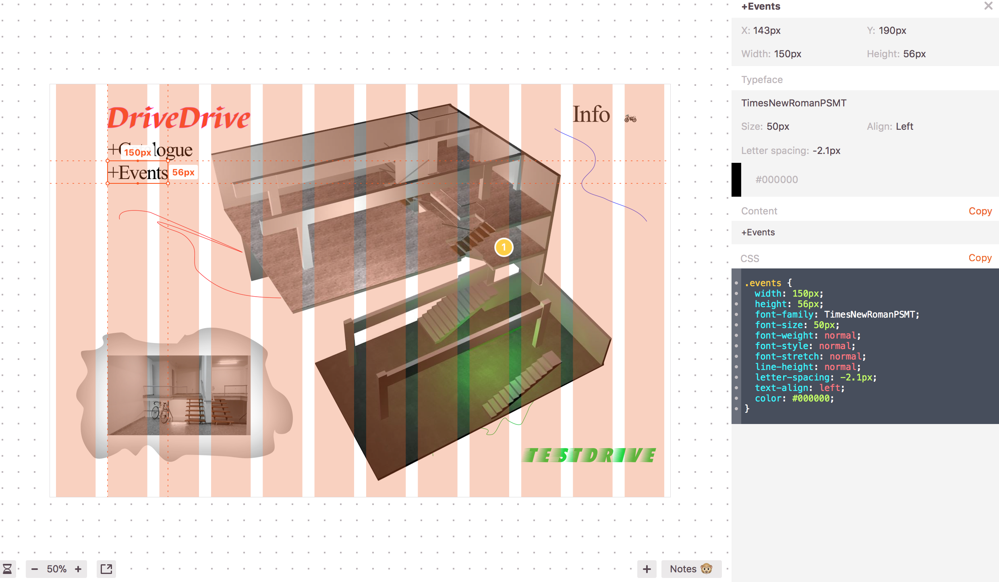
>>>>>>> 03bfecf16822cd992f357d04e0379c9b8bd1ff51

```css
.events {
	width: 150px;
	height: 56px;
	font-family: TimesNewRomanPSMT;
	font-size: 50px;
	font-weight: normal;
	font-style: normal;
	font-stretch: normal;
	line-height: normal;
	letter-spacing: -2.1px;
	text-align: left;
	color: #000000;
}
```

Image behind video

<<<<<<< HEAD

=======
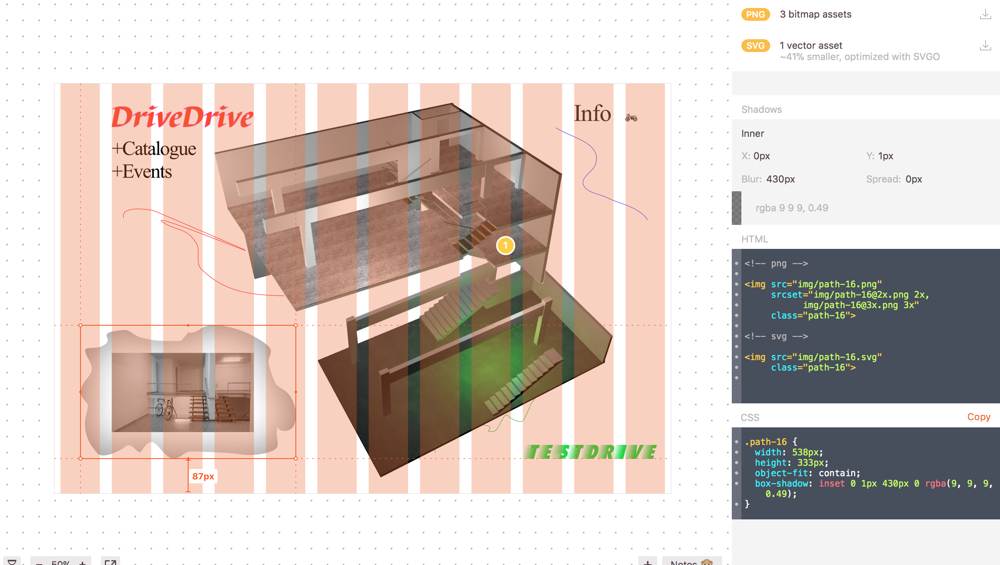
>>>>>>> 03bfecf16822cd992f357d04e0379c9b8bd1ff51

```css
.img-video-background {
	width: 538px;
	height: 333px;
	object-fit: contain;
	box-shadow: inset 0 1px 430px 0 rgba(9, 9, 9, 0.49);
}
```


Video 

<<<<<<< HEAD

=======
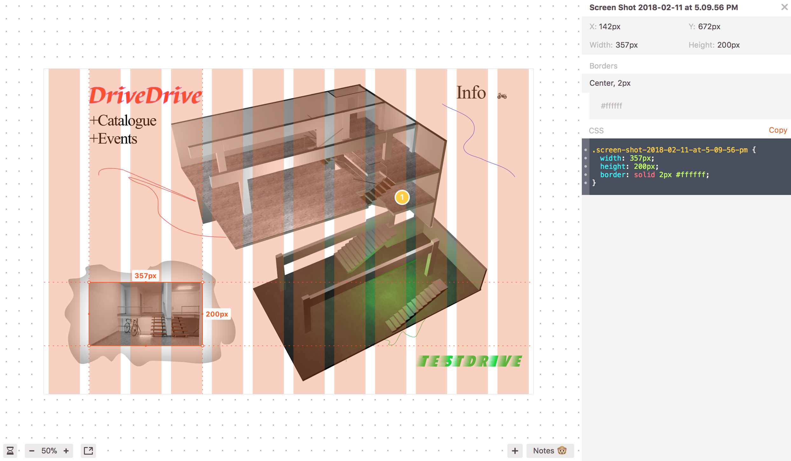
>>>>>>> 03bfecf16822cd992f357d04e0379c9b8bd1ff51

```
.video-home {
	width: 357px;
	height: 200px;
	border: solid 2px #ffffff;
}
```

Red Line

<<<<<<< HEAD

=======
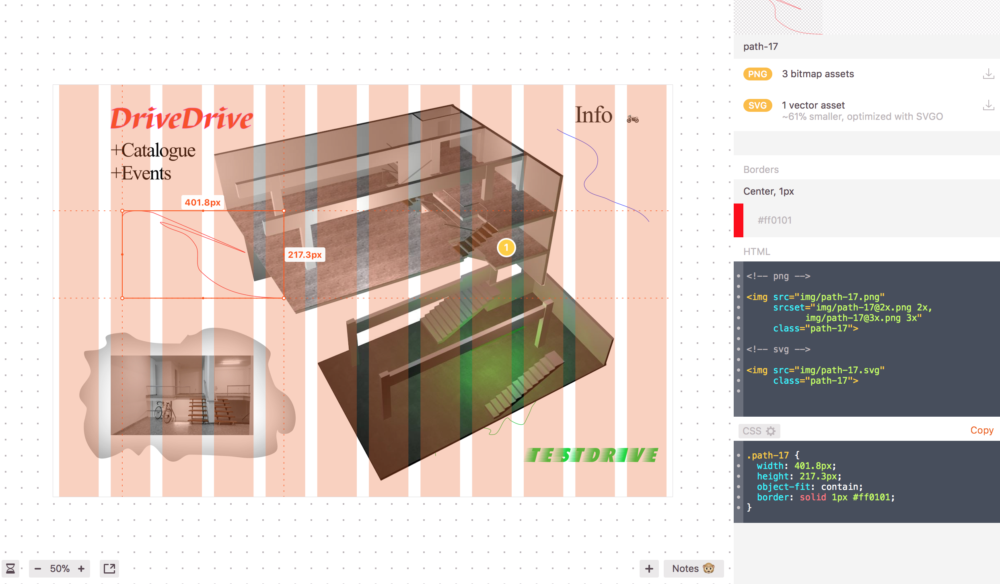
>>>>>>> 03bfecf16822cd992f357d04e0379c9b8bd1ff51

```css
.redline-img-home {
	width: 401.8px;
	height: 217.3px;
	object-fit: contain;
	border: solid 1px #ff0101;
}
```

Info

<<<<<<< HEAD

=======
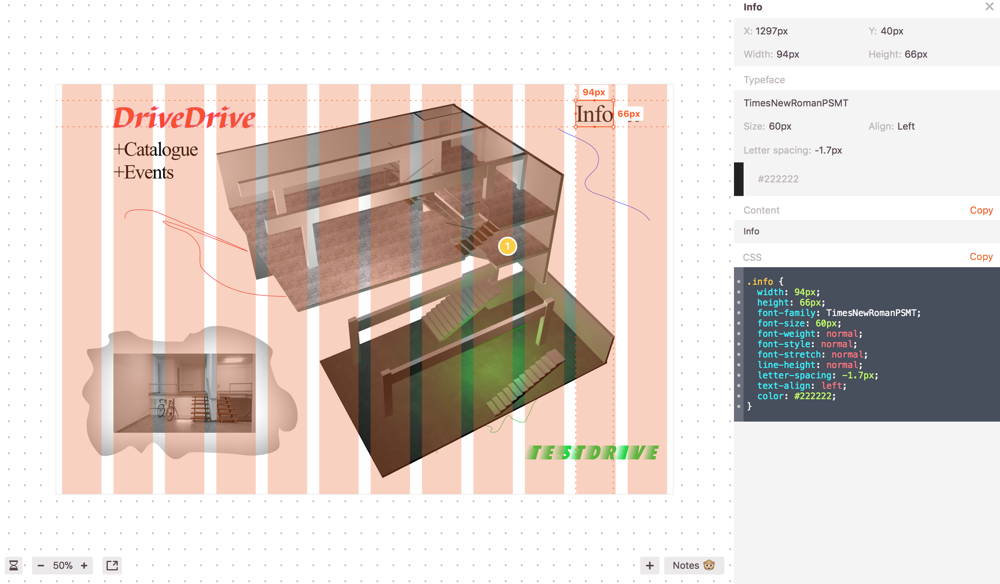
>>>>>>> 03bfecf16822cd992f357d04e0379c9b8bd1ff51

```css
.info {
	width: 94px;
	height: 66px;
	font-family: TimesNewRomanPSMT;
	font-size: 60px;
	font-weight: normal;
	font-style: normal;
	font-stretch: normal;
	line-height: normal;
	letter-spacing: -1.7px;
	text-align: left;
	color: #222222;
}
```


testdrive-home

<<<<<<< HEAD

=======
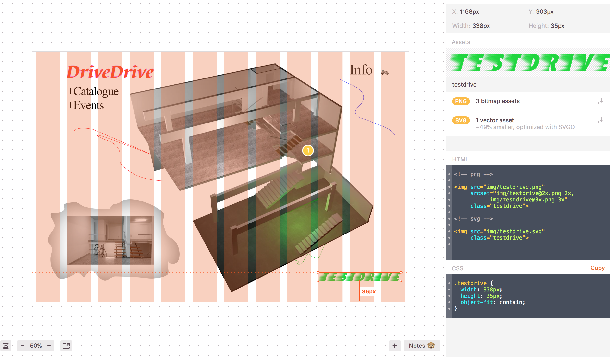
>>>>>>> 03bfecf16822cd992f357d04e0379c9b8bd1ff51

```css
.testdrive-home {
	width: 338px;
	height: 35px;
	object-fit: contain;
}
```

motor bike

<<<<<<< HEAD

=======
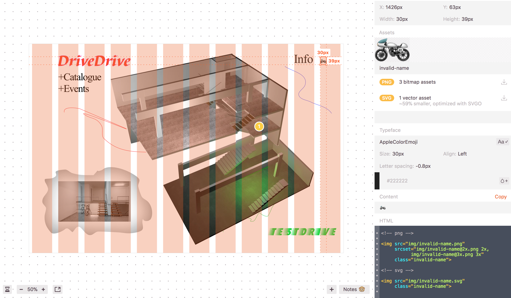
>>>>>>> 03bfecf16822cd992f357d04e0379c9b8bd1ff51

```
.motorbike {
	width: 30px;
	height: 39px;
	object-fit: contain;
	font-family: AppleColorEmoji;
	font-size: 30px;
	font-weight: normal;
	font-style: normal;
	font-stretch: normal;
	line-height: normal;
	letter-spacing: -0.8px;
	text-align: left;
	color: #222222;
}
```


Image - the two images are now one:

<<<<<<< HEAD

=======
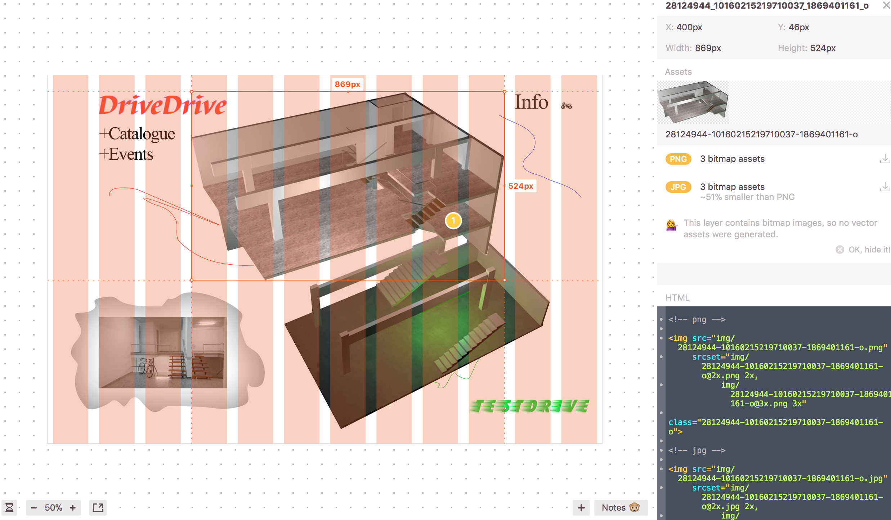
>>>>>>> 03bfecf16822cd992f357d04e0379c9b8bd1ff51

```css
.img-space-hm {
	width: 869px;
	height: 524px;
	object-fit: contain;
}
```


Info blue img and text (separate elements) Appearing on Click

<<<<<<< HEAD

=======
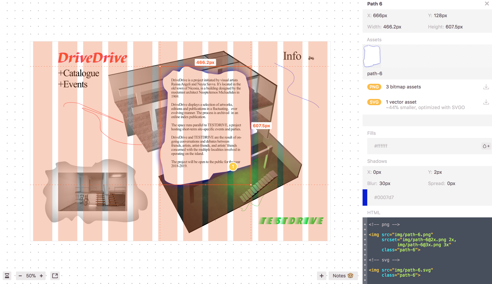
>>>>>>> 03bfecf16822cd992f357d04e0379c9b8bd1ff51

```
.info-space-img-hm {
	width: 466.2px;
	height: 607.5px;
	object-fit: contain;
	background-color: #ffffff;
	box-shadow: 0 2px 30px 0 #0007d7;
}
```


<<<<<<< HEAD
Info text
=======
Info text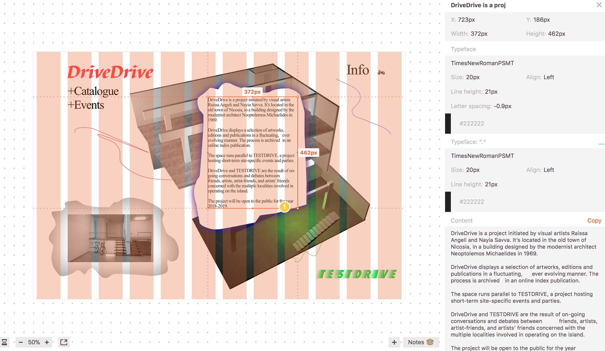
>>>>>>> 03bfecf16822cd992f357d04e0379c9b8bd1ff51

```css
.info-space-text-hm {
	width: 372px;
	height: 462px;
	font-family: TimesNewRomanPSMT;
	font-size: 20px;
	font-weight: normal;
	font-style: normal;
	font-stretch: normal;
	line-height: 1.05;
	letter-spacing: -0.9px;
	text-align: left;
	color: #222222;
}

.infotext .text-style-1 {
	letter-spacing: normal;
}
```


---

INTO DRIVE DRIVE PAGE

purple line img

<<<<<<< HEAD

=======
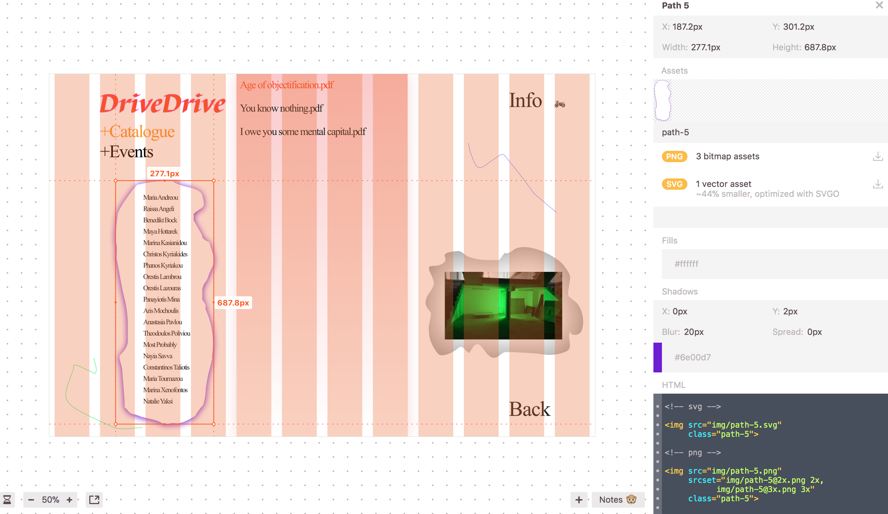
>>>>>>> 03bfecf16822cd992f357d04e0379c9b8bd1ff51

```
.purple-line-img-drv {
	width: 277.1px;
	height: 687.8px;
	object-fit: contain;
	background-color: #ffffff;
	box-shadow: 0 2px 20px 0 #6e00d7;
}
```


artist list

<<<<<<< HEAD

=======
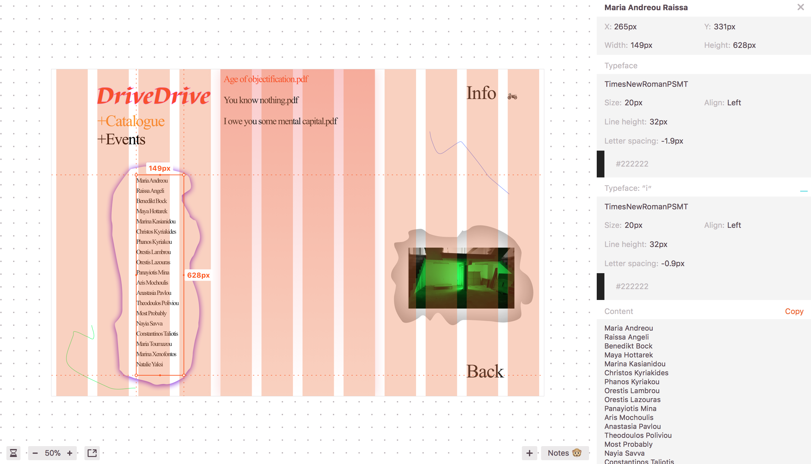
>>>>>>> 03bfecf16822cd992f357d04e0379c9b8bd1ff51

```css
.artist-list-drv {
	width: 149px;
	height: 628px;
	font-family: TimesNewRomanPSMT;
	font-size: 20px;
	font-weight: normal;
	font-style: normal;
	font-stretch: normal;
	line-height: 1.6;
	letter-spacing: -1.9px;
	text-align: left;
	color: #222222;
}

.aritst-list .text-style-1 {
	letter-spacing: -0.9px;
}
```


PDF

<<<<<<< HEAD

=======
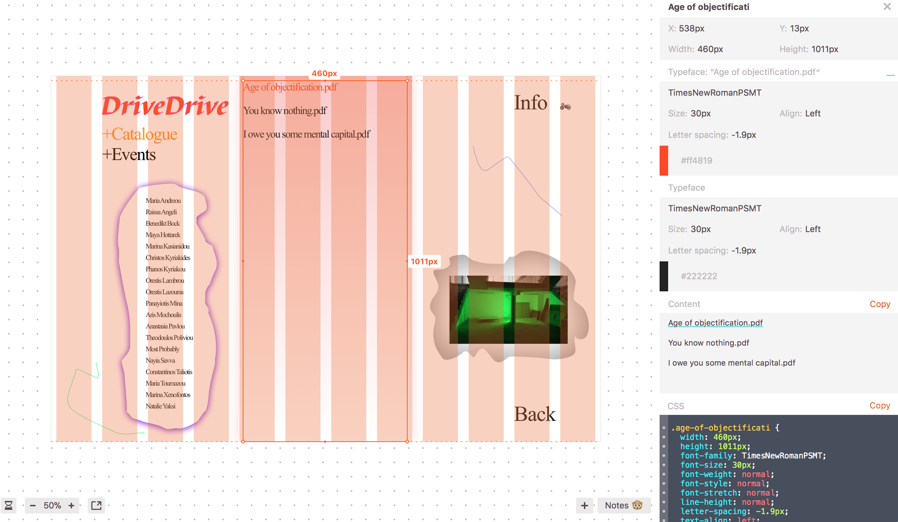
>>>>>>> 03bfecf16822cd992f357d04e0379c9b8bd1ff51

```css
.pdf-drv {
	width: 460px;
	height: 1011px;
	font-family: TimesNewRomanPSMT;
	font-size: 30px;
	font-weight: normal;
	font-style: normal;
	font-stretch: normal;
	line-height: normal;
	letter-spacing: -1.9px;
	text-align: left;
	color: #222222;
}

.pdf .text-style-1 {
	color: #ff4819;
}
```


green line

<<<<<<< HEAD

=======
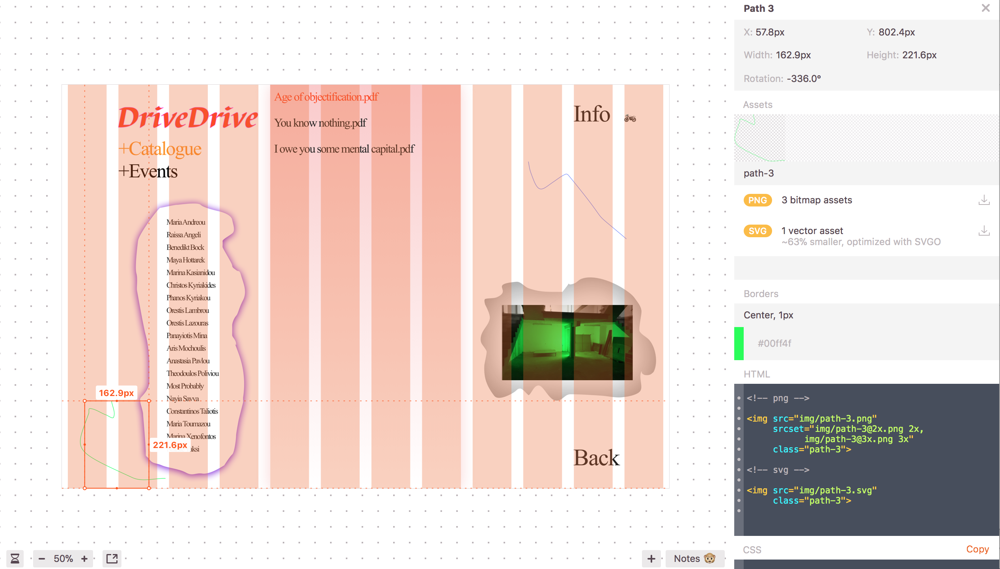
>>>>>>> 03bfecf16822cd992f357d04e0379c9b8bd1ff51

```
.green-line-img-drv {
	width: 162.9px;
	height: 221.6px;
	object-fit: contain;
	-webkit-transform: rotate(336deg);
	transform: rotate(336deg);
	border: solid 1px #00ff4f;
}
```


video img background

<<<<<<< HEAD

=======
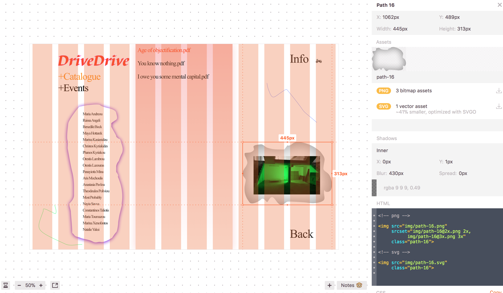
>>>>>>> 03bfecf16822cd992f357d04e0379c9b8bd1ff51

```
.video-background-img-drv {
	width: 445px;
	height: 313px;
	object-fit: contain;
	box-shadow: inset 0 1px 430px 0 rgba(9, 9, 9, 0.49);
}
```


video Drive Drive

<<<<<<< HEAD

=======
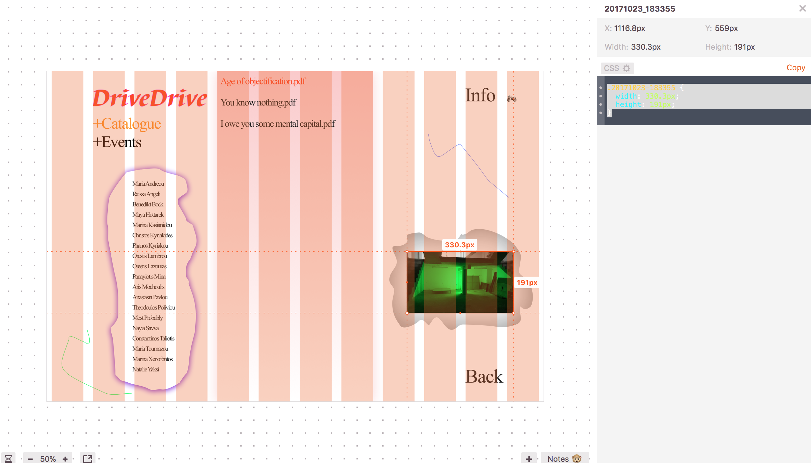
>>>>>>> 03bfecf16822cd992f357d04e0379c9b8bd1ff51

```
.video-catalogue-drv {
	width: 330.3px;
	height: 191px;
}
```


Blue line drive drive

<<<<<<< HEAD

=======
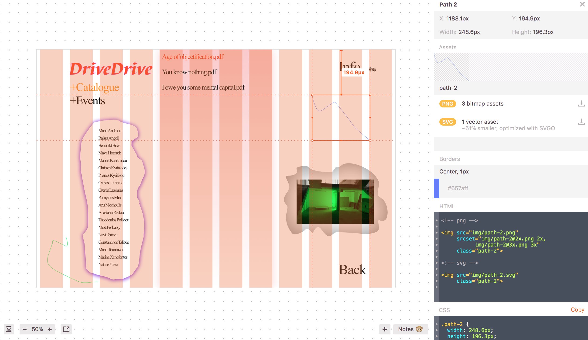
>>>>>>> 03bfecf16822cd992f357d04e0379c9b8bd1ff51

```css
.blue-line-img-drv {
	width: 248.6px;
	height: 196.3px;
	object-fit: contain;
	border: solid 1px #657aff;
}
```


Back

<<<<<<< HEAD

=======
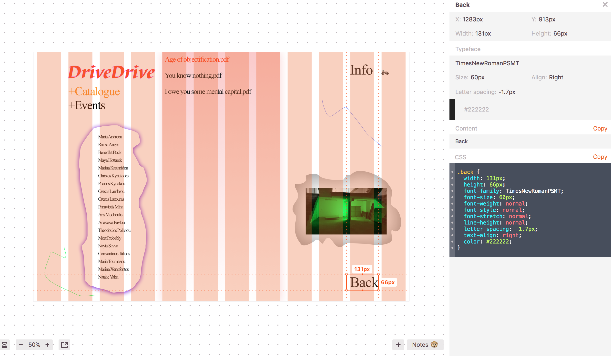
>>>>>>> 03bfecf16822cd992f357d04e0379c9b8bd1ff51

```css
.back {
	width: 131px;
	height: 66px;
	font-family: TimesNewRomanPSMT;
	font-size: 60px;
	font-weight: normal;
	font-style: normal;
	font-stretch: normal;
	line-height: normal;
	letter-spacing: -1.7px;
	text-align: right;
	color: #222222;
}
```


---

DriveDrive Events

Top artist-name-events-dr

<<<<<<< HEAD

=======
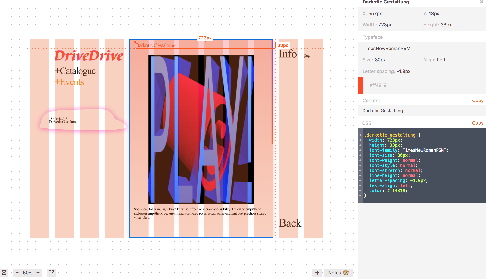
>>>>>>> 03bfecf16822cd992f357d04e0379c9b8bd1ff51

```
.title-artist-name-drv {
	width: 723px;
	height: 33px;
	font-family: TimesNewRomanPSMT;
	font-size: 30px;
	font-weight: normal;
	font-style: normal;
	font-stretch: normal;
	line-height: normal;
	letter-spacing: -1.9px;
	text-align: left;
	color: #ff4819;
}
```


image-events-drive


```css
.events-img-drv {
	width: 723px;
	height: 33px;
	font-family: TimesNewRomanPSMT;
	font-size: 30px;
	font-weight: normal;
	font-style: normal;
	font-stretch: normal;
	line-height: normal;
	letter-spacing: -1.9px;
	text-align: left;
	color: #ff4819;
}
```


Events description drive drive


```
.events-description-drv {
	width: 694px;
	height: 66px;
	font-family: TimesNewRomanPSMT;
	font-size: 20px;
	font-weight: normal;
	font-style: normal;
	font-stretch: normal;
	line-height: normal;
	letter-spacing: -0.9px;
	text-align: left;
	color: #000000;
}
```


Pink line img drive drive


```css
.pinkline-img-drv {
	width: 445px;
	height: 107.9px;
	object-fit: contain;
	background-color: #ffffff;
	box-shadow: 0 2px 30px 0 #fa69db;
}
```


Drive drive events Date


```
.events-date-drv {
	width: 93px;
	height: 37px;
	font-family: TimesNewRomanPSMT;
	font-size: 17px;
	font-weight: normal;
	font-style: normal;
	font-stretch: normal;
	line-height: 2.18;
	letter-spacing: -0.9px;
	text-align: left;
	color: #222222;
}
```


Drive drive events artistname


```
.events-name-drv {
	width: 204px;
	height: 33px;
	font-family: TimesNewRomanPSMT;
	font-size: 20px;
	font-weight: normal;
	font-style: normal;
	font-stretch: normal;
	line-height: 1.85;
	letter-spacing: -0.9px;
	text-align: left;
	color: #222222;
}
```


event info modal // 


```
.event-info-modal-drv {
	width: 740px;
	height: 1021px;
	object-fit: contain;
	background-image: linear-gradient(to bottom, #fbcaca, #ffffff);
	box-shadow: 0 2px 40px 0 rgba(246, 173, 173, 0.5);
}
```

---

Testdrive


```
.event-info-modal-trv {
	width: 740px;
	height: 1024px;
	object-fit: contain;
	background-image: linear-gradient(to bottom, #d1fbca, #ffffff);
	box-shadow: 0 2px 40px 0 #d1fbca;
}
```


green-line-img-tr


```
.greenline-img-trv {
	width: 445px;
	height: 107.9px;
	object-fit: contain;
	background-color: #ffffff;
	box-shadow: 0 2px 30px 0 #1fe04d;
}
```


testdrive events date


```
.greenline-img-trv {
	width: 60px;
	height: 37px;
	font-family: TimesNewRomanPSMT;
	font-size: 17px;
	font-weight: normal;
	font-style: normal;
	font-stretch: normal;
	line-height: 2.18;
	letter-spacing: -0.9px;
	text-align: left;
	color: #222222;
}
```


event title testdrive


```
.event-title-trv {
	width: 204px;
	height: 33px;
	font-family: TimesNewRomanPSMT;
	font-size: 20px;
	font-weight: normal;
	font-style: normal;
	font-stretch: normal;
	line-height: 1.85;
	letter-spacing: -0.9px;
	text-align: left;
	color: #222222;
}
```


---

InfoPage

background image for info


```
.image-info-outline {
	width: 446.4px;
	height: 515.3px;
	object-fit: contain;
	background-color: #ffffff;
	box-shadow: 0 2px 40px 0 rgba(0, 0, 0, 0.5);
	border: solid 1px #979797;
}
```


gallery info 


```
.gallery-info {
	width: 446.4px;
	height: 515.3px;
	object-fit: contain;
	background-color: #ffffff;
	box-shadow: 0 2px 40px 0 rgba(0, 0, 0, 0.5);
	border: solid 1px #979797;
}
```


sign up


```
.sign-up-to-our-list {
	width: 245px;
	height: 23px;
	font-family: TimesNewRomanPSMT;
	font-size: 20px;
	font-weight: normal;
	font-style: normal;
	font-stretch: normal;
	line-height: 1.05;
	letter-spacing: -0.9px;
	text-align: left;
	color: #222222;
}
```


sign up input


```
.sign-up-input {
	width: 221px;
	height: 40px;
	border: solid 1px #000000;
}
```

button


```
.sign-up-button {
	width: 108px;
	height: 40px;
	border: solid 1px #000000;
}
```


Info page map


```
.infopage-map {
	width: 108px;
	height: 40px;
	border: solid 1px #000000;
}
```


Testdrive on right corner


```
.testdrive {
	width: 338px;
	height: 35px;
	object-fit: contain;
}
```


cc


```
.cc {
	width: 361px;
	height: 14px;
	font-family: TimesNewRomanPSMT;
	font-size: 12px;
	font-weight: normal;
	font-style: normal;
	font-stretch: normal;
	line-height: normal;
	letter-spacing: -1.5px;
	text-align: left;
	color: #ffffff;
}
```

